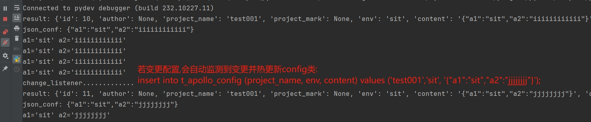

# MySQL_Apollo
- 优点:
  - 配置管理简单明朗
  - 支持 项目&环境 管理
  - 支持配置变更日志
  - 支持配置回滚
  - 支持配置热更新

# 使用指南
- 启动服务时指定数据库环境变量 - host/port/user/password/db
- 配置变更时直接插入新配置(会检测到新配置并热更新)
  - eg: insert into t_apollo_config (project_name, env, content) values ('test001','sit', '{"a1":"sit","a2":"kkkk"}');

# Demo效果



# pip依赖
- pip install pydantic
- pip install pymysql


# 建表SQL
```sql
CREATE TABLE `t_apollo_config`
(
    `id`           int(11)   NOT NULL AUTO_INCREMENT COMMENT '主键编码',
    `author`       varchar(256)       DEFAULT NULL COMMENT '作者',
    `project_name`   varchar(256)       NOT NULL COMMENT '项目名',
    `project_mark`   varchar(256)       DEFAULT NULL COMMENT '项目描述',
    `env`   varchar(256)       DEFAULT 'dev' COMMENT '环境:dev/sit/prod',
    `content`      text               DEFAULT null COMMENT '配置内容:json',
    `created_time` timestamp NOT NULL DEFAULT current_timestamp() COMMENT '创建时间',
    `updated_time` timestamp NOT NULL DEFAULT current_timestamp() ON UPDATE current_timestamp() COMMENT '更新时间',
    `version`      varchar(256)        DEFAULT 'v1' COMMENT '版本',
    PRIMARY KEY (`id`)
) ENGINE = InnoDB
  DEFAULT CHARSET = utf8mb4 COMMENT ='配置表';
```
